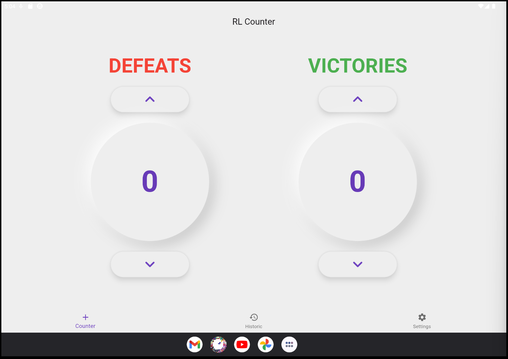
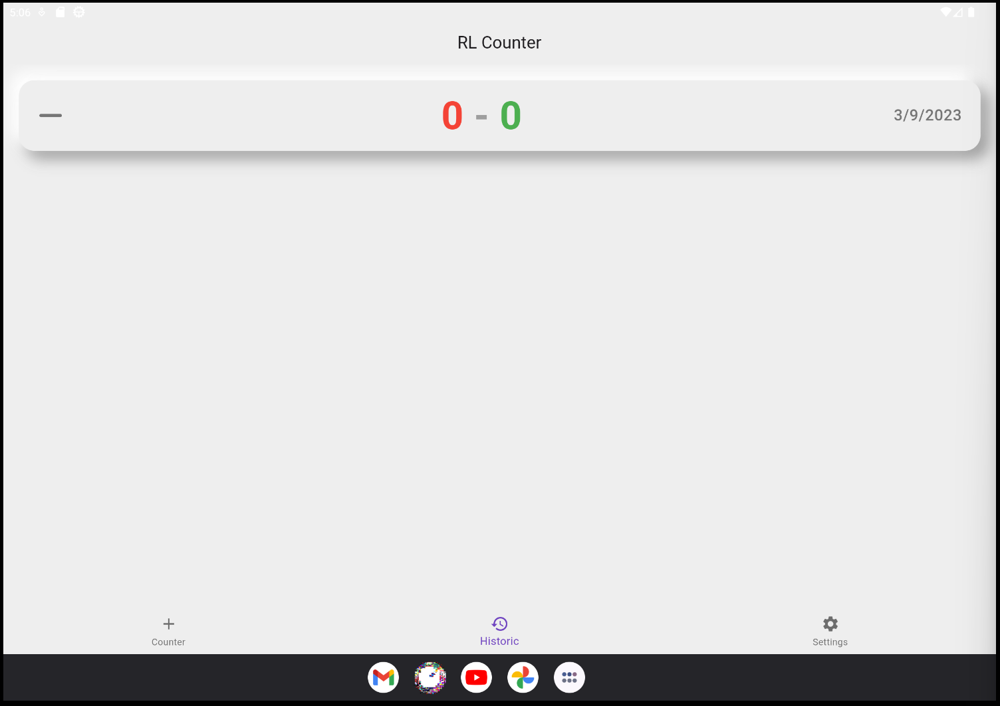
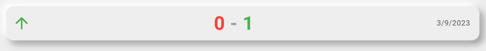
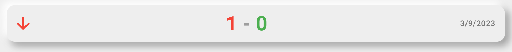
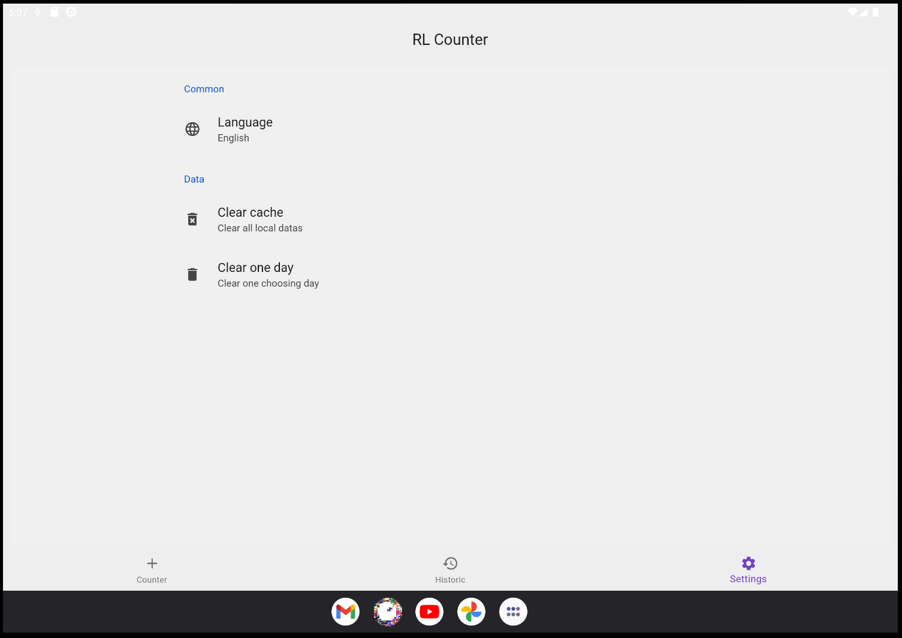

# rl_counter

A manual victories/defeats counter for the game [Rogue Legacy](https://www.rocketleague.com/). It provides a straightforward way to keep track of your wins and losses in the game.

The app is made with a neumorphic design that I like a lot.

> Please note that this counter is optimized for tablet and desktop usage. It is not responsive and will not work on mobile.

## The App

1. **Navigate Through Tabs** : The main screen of rl_counter consists of three tabs - Counter, Historic, and Settings. You can switch between these tabs using the bottom navigation bar.


2. **Counter Tab** : In this tab, you can manually increase or decrease your victories and defeats counts. The data is saved automatically and can be viewed in the Historic tab. You can increase the count by tapping on the increase button aor on the counter itself. But you can only decrease the count by tapping on the decrease button.



3. **Historic Tab** : This tab displays a history of your victories and defeats, along with the respective dates. It provides you with a record of your progress over time. You can easily see if you have been winning or losing more often with icons on the left. You can also see the total number of victories and defeats you have had so far.





4. **Settings Tab** : The Settings tab allows you to customize the app's behavior. You can clear all data or choose to clear data for a specific day.



## Features

- **Victories and Defeats Tracking** : Easily track your victories and defeats in Rogue Legacy.

- **Historic Data** : View a historical record of your gameplay, including dates and win/loss counts.

- **Settings** : Customize the app's behavior with options to clear data.

- **Intuitive Interface** : The app features a user-friendly interface for effortless tracking.

## Usage

rl_counter is designed to enhance your Rogue Legacy gaming experience by helping you keep a detailed record of your performance. Whether you want to track your progress or set personal goals, this app is your ideal companion.

## Technical Details

- **Initialize the Database** : rl_counter uses Hive as its database to store your victories and defeats data. Upon starting the app, the Hive database is initialized and a box named 'counters' is opened to store the data.

```dart
void main() async {
  // Initialize Hive database
  await Hive.initFlutter();

  // Open the 'counters' box (database)
  await Hive.openBox('counters');

  runApp(const MyApp());
}
```

## Contributions

Contributions to rl_counter are welcome! If you have ideas for improvements or new features, feel free to submit a pull request.

## Acknowledgments

- Special thanks to the Rogue Legacy community for inspiring this project.
- This app was developed using the Flutter framework.

Enjoy tracking your victories and defeats with rl_counter! If you have any questions or encounter issues, please don't hesitate to reach out.
